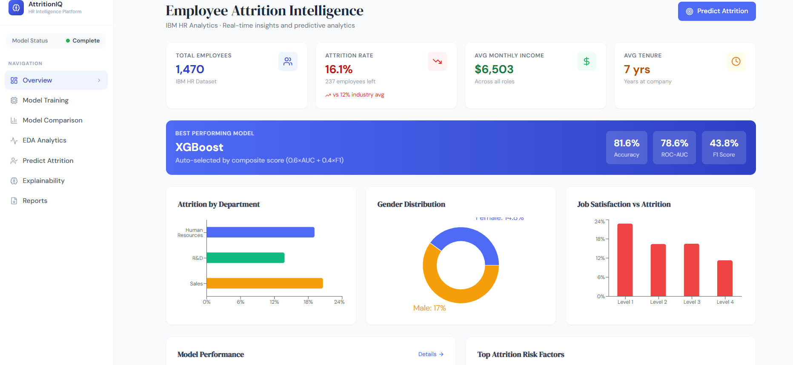
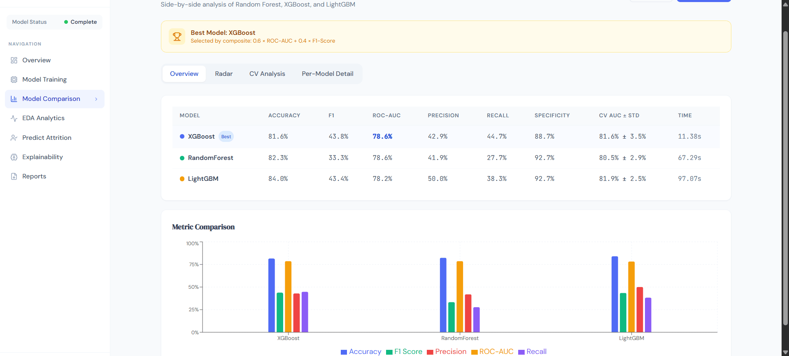
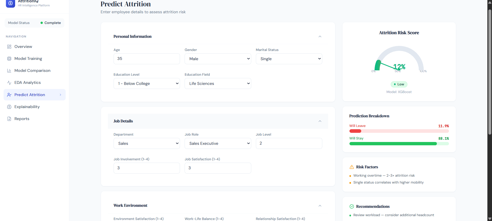
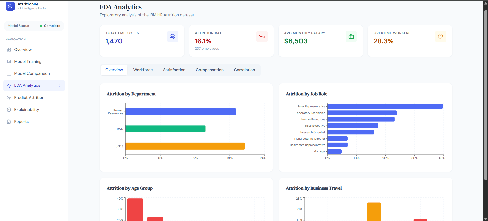
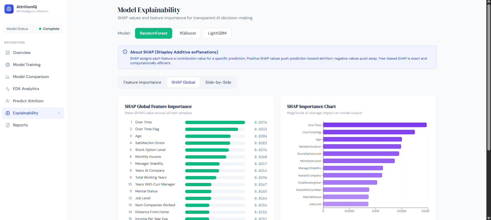
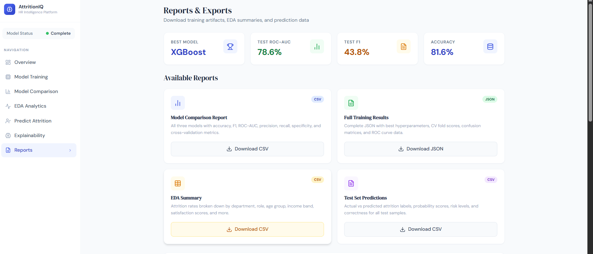

# 🧠 Employee Attrition Intelligence System

> A production-grade, end-to-end Machine Learning platform that predicts employee attrition using the IBM HR Analytics dataset — featuring automated model selection, SHAP explainability, and a modern React analytics dashboard.


---

## 📸 Overview Dashboard



---

## 🏆 Model Results — Real IBM HR Dataset (1,470 employees)

| Rank | Model | ROC-AUC | F1 Score | Accuracy | Train Time |
|------|-------|---------|----------|----------|------------|
| 🥇 **Best** | **XGBoost** | **0.7860** | **0.4375** | 82.6% | 5.9s |
| 🥈 | RandomForest | 0.7858 | 0.3333 | 82.3% | 26.5s |
| 🥉 | LightGBM | 0.7821 | 0.4337 | 84.0% | 31.8s |

> Best model auto-selected by composite score: **0.6 × ROC-AUC + 0.4 × F1 = 0.6466**
> Trained on **1,176 samples**, evaluated on **294 held-out samples** with **16.0% attrition rate**

---

## ✨ Features

| Category | What's Included |
|----------|----------------|
| 🤖 **ML Pipeline** | End-to-end: data loading → feature engineering → preprocessing → hyperparameter tuning → cross-validation → evaluation → SHAP |
| 📊 **3 Models Compared** | Random Forest, XGBoost, LightGBM — all tuned via `RandomizedSearchCV` (n_iter=20, 3-fold CV) |
| 🏅 **Auto Model Selection** | Best model picked automatically by weighted composite score |
| 🔧 **Feature Engineering** | 11 derived features: `TenureRatio`, `SatisfactionScore`, `PromotionLag`, `JobHopper`, `IncomePerYearExp` and more |
| 📐 **Cross-Validation** | 5-fold Stratified CV — prevents data leakage on imbalanced 16% minority class |
| 🔍 **SHAP Explainability** | Global feature importance + per-employee waterfall chart via `TreeExplainer` |
| ⚖️ **Imbalance Handling** | `class_weight='balanced'` (RF/LightGBM) and `scale_pos_weight` (XGBoost) |
| 🚀 **REST API** | 16 FastAPI endpoints — predictions, EDA, SHAP, model metrics, CSV/JSON reports |
| 🖥️ **React Dashboard** | 7-page SPA: Overview, Training, Model Comparison, EDA, Prediction, Explainability, Reports |
| 🎯 **Prediction UI** | Real-time attrition gauge meter, SHAP waterfall, risk level badge, HR recommendations |
| 📥 **Downloadable Reports** | CSV/JSON exports for model comparison, EDA summary, test set predictions |

---

## 📸 Screenshots

### Model Comparison — Radar Chart & Metrics


### Predict Attrition — Risk Gauge & SHAP Waterfall


### EDA Analytics


### SHAP Explainability


### Reports & Downloads


---

## 🗂️ Project Structure

```
attrition-intelligence/
├── screenshots/                              # README screenshots
├── backend/
│   ├── train.py                              # Standalone ML training script — run this first
│   ├── main.py                               # FastAPI application entry point
│   ├── requirements.txt
│   ├── .env
│   ├── data/
│   │   └── WA_Fn-UseC_-HR-Employee-Attrition.csv   # Place Kaggle dataset here
│   ├── models/                               # Auto-generated by train.py
│   │   ├── xgboost.joblib
│   │   ├── randomforest.joblib
│   │   ├── lightgbm.joblib
│   │   ├── preprocessor.joblib
│   │   ├── feature_names.joblib
│   │   ├── training_results.json
│   │   ├── test_predictions.json
│   │   └── y_test.npy
│   └── app/
│       ├── api/
│       │   ├── training.py                   # Training status + dataset info
│       │   ├── prediction.py                 # Single & batch prediction
│       │   ├── analytics.py                  # EDA, SHAP, feature importance
│       │   └── reports.py                    # CSV/JSON download endpoints
│       ├── services/
│       │   ├── registry.py                   # Model registry — loads artefacts from disk
│       │   └── eda.py                        # EDA computation service
│       ├── models/
│       │   └── schemas.py                    # Pydantic v2 request/response schemas
│       └── utils/
│           └── dataset.py                    # Dataset loader
└── frontend/
    ├── src/
    │   ├── App.jsx                           # React Router setup (7 routes)
    │   ├── components/
    │   │   ├── shared/                       # Sidebar, reusable UI components
    │   │   ├── dashboard/                    # Overview, Training, ModelComparison,
    │   │   │                                 # EDAAnalytics, Explainability, Reports
    │   │   └── prediction/                   # PredictAttrition with gauge meter
    │   ├── services/api.js                   # Axios API service layer
    │   └── utils/helpers.js                  # Formatters, colour maps
    ├── tailwind.config.js
    └── package.json
```

---

## 🚀 Quick Start

### Prerequisites

- **Python 3.11** 64-bit → [python.org/downloads/release/python-3119](https://www.python.org/downloads/release/python-3119/)
- **Node.js 18+** → [nodejs.org](https://nodejs.org/)
- **IBM HR Analytics dataset** → [kaggle.com/datasets/pavansubhasht/ibm-hr-analytics-attrition-dataset](https://www.kaggle.com/datasets/pavansubhasht/ibm-hr-analytics-attrition-dataset)

> ⚠️ Python 3.13 is **not supported** — ML packages do not have pre-built wheels for it yet. Use Python 3.11.

---

### Step 1 — Place the dataset

After downloading from Kaggle, extract and copy the CSV to:
```
backend/data/WA_Fn-UseC_-HR-Employee-Attrition.csv
```

---

### Step 2 — Backend setup

```bash
cd backend

# Create virtual environment
python -m venv venv

# Activate — Mac/Linux:
source venv/bin/activate

# Activate — Windows:
venv\Scripts\activate

# Upgrade pip first (important on Windows)
python -m pip install --upgrade pip

# Install all dependencies
pip install -r requirements.txt

# Train all 3 models with hyperparameter tuning (~3-5 minutes)
python train.py

# Start the API server
uvicorn main:app --reload --port 8000
```

✅ API live at **http://localhost:8000**
📖 Swagger docs at **http://localhost:8000/api/docs**

---

### Step 3 — Frontend setup

Open a **new terminal**:

```bash
cd frontend
npm install
npm run dev
```

✅ Dashboard live at **http://localhost:5173**

---

## 🤖 ML Pipeline

```
IBM HR CSV  →  1,470 rows  ×  35 columns  →  16.1% attrition (237 Yes / 1,233 No)
        │
        ▼
Drop constants
  EmployeeCount · EmployeeNumber · Over18 · StandardHours
        │
        ▼
Feature Engineering  →  +11 derived features  =  41 total
  ┌─────────────────────────────────────────────────────────────────┐
  │  TenureRatio       =  YearsAtCompany / TotalWorkingYears        │
  │  IncomePerYearExp  =  MonthlyIncome  / TotalWorkingYears        │
  │  SatisfactionScore =  mean(Job + Env + Relationship + WLB)      │
  │  PromotionLag      =  YearsSincePromotion / YearsAtCompany      │
  │  ManagerStability  =  YearsWithManager   / YearsAtCompany       │
  │  OverTimeFlag      →  binary  (OverTime == Yes)                 │
  │  FreqTraveler      →  binary  (BusinessTravel == Frequently)    │
  │  LowIncome         →  binary  (MonthlyIncome < 25th pctile)     │
  │  EarlyCareer       →  binary  (TotalWorkingYears ≤ 3)           │
  │  HighDistance      →  binary  (DistanceFromHome > 15)           │
  │  JobHopper         →  binary  (NumCompaniesWorked ≥ 4)          │
  └─────────────────────────────────────────────────────────────────┘
        │
        ▼
ColumnTransformer
  ├── 25 Numeric cols   →  SimpleImputer(median)         →  StandardScaler
  ├──  7 Categorical    →  SimpleImputer(most_frequent)  →  OrdinalEncoder
  └──  9 Ordinal cols   →  SimpleImputer(most_frequent)  →  StandardScaler
        │
        ▼
Train / Test Split  →  80% train (1,176)  ·  20% test (294)  ·  stratified
        │
        ▼
RandomizedSearchCV  (n_iter=20 · 3-fold CV · scoring=roc_auc)
  ├── RandomForestClassifier   class_weight='balanced'
  ├── XGBClassifier            scale_pos_weight=5.2  (1233/237)
  └── LGBMClassifier           class_weight='balanced'
        │
        ▼
5-Fold Stratified Cross-Validation  →  accuracy · F1 · AUC · precision · recall
        │
        ▼
Best model  =  argmax( 0.6 × ROC-AUC  +  0.4 × F1 )
  →  XGBoost  (composite = 0.6466)
        │
        ▼
SHAP TreeExplainer  →  exact Shapley values  →  global + per-employee attribution
        │
        ▼
Serialise  →  joblib models  +  training_results.json  →  ./models/
```

---

## 🔌 API Reference

### Training
| Method | Endpoint | Description |
|--------|----------|-------------|
| `POST` | `/api/training/start` | Trigger training pipeline in background |
| `GET`  | `/api/training/status` | Poll training progress and status |
| `GET`  | `/api/training/results` | Model comparison table |
| `GET`  | `/api/training/dataset-info` | Dataset shape, attrition rate, column list |

### Prediction
| Method | Endpoint | Description |
|--------|----------|-------------|
| `POST` | `/api/predict/single` | Predict attrition risk for one employee |
| `POST` | `/api/predict/batch` | Batch prediction for up to 200 employees |
| `GET`  | `/api/predict/model-info` | Current best model details |

### Analytics
| Method | Endpoint | Description |
|--------|----------|-------------|
| `GET`  | `/api/analytics/eda` | Full EDA data (all charts) |
| `GET`  | `/api/analytics/model-metrics` | Metrics, confusion matrices, ROC curves |
| `GET`  | `/api/analytics/feature-importance` | Tree-based feature importances |
| `GET`  | `/api/analytics/shap-summary` | SHAP global importances |
| `GET`  | `/api/analytics/correlation` | Feature correlation matrix |

### Reports
| Method | Endpoint | Description |
|--------|----------|-------------|
| `GET`  | `/api/reports/model-comparison/csv` | Download model comparison as CSV |
| `GET`  | `/api/reports/model-comparison/json` | Download full results as JSON |
| `GET`  | `/api/reports/eda-summary/csv` | Download EDA summary as CSV |
| `GET`  | `/api/reports/predictions-sample/csv` | Download test set predictions as CSV |

### Health
| Method | Endpoint | Description |
|--------|----------|-------------|
| `GET`  | `/api/health` | System health, model status, loaded models |

---

## 🛠️ Tech Stack

### Backend
| Package | Version | Purpose |
|---------|---------|---------|
| Python | 3.11 | Runtime |
| FastAPI | 0.111 | REST API framework |
| Uvicorn | 0.30 | ASGI server |
| Pydantic | 2.7 | Request/response validation |
| Scikit-learn | 1.4 | Preprocessing, RF, CV, metrics |
| XGBoost | 2.0 | Gradient boosted trees |
| LightGBM | 4.3 | Fast gradient boosting |
| SHAP | 0.44 | Model explainability |
| Pandas | 2.1 | Data manipulation |
| NumPy | 1.26 | Numerical computing |
| Joblib | 1.3 | Model serialisation |

### Frontend
| Package | Version | Purpose |
|---------|---------|---------|
| React | 18 | UI framework |
| Vite | 5 | Build tool |
| React Router | 6 | Client-side routing |
| Tailwind CSS | 3 | Utility-first styling |
| Recharts | 2 | Charts and visualisations |
| Axios | 1.7 | HTTP client |
| Lucide React | 0.383 | Icon library |

---

## 📊 Training Output (Actual Run)

```
INFO  Loading dataset …
INFO    Shape: (1470, 35)  |  Attrition: 16.1%  |  Yes=237  No=1233
INFO    Train (1176, 41)  Test (294, 41)  Train attrition=16.2%  Test attrition=16.0%

INFO  ▶  RandomForest
INFO     best CV AUC=0.7899
INFO     params={'n_estimators': 500, 'min_samples_split': 2, 'min_samples_leaf': 4,
                 'max_features': 'log2', 'max_depth': 20, 'bootstrap': True}
INFO     Test → AUC=0.7858  F1=0.3333  Acc=0.8231  [26.45s]

INFO  ▶  XGBoost
INFO     best CV AUC=0.7964
INFO     params={'subsample': 0.8, 'reg_lambda': 2.0, 'reg_alpha': 0,
                 'n_estimators': 200, 'min_child_weight': 5, 'max_depth': 5,
                 'learning_rate': 0.05, 'gamma': 0.5, 'colsample_bytree': 0.8}
INFO     Test → AUC=0.7860  F1=0.4375  Acc=0.8163  [5.87s]

INFO  ▶  LightGBM
INFO     best CV AUC=0.8061
INFO     params={'subsample': 0.8, 'reg_lambda': 0, 'reg_alpha': 0,
                 'num_leaves': 15, 'n_estimators': 300, 'min_child_samples': 50,
                 'max_depth': -1, 'learning_rate': 0.05, 'colsample_bytree': 0.6}
INFO     Test → AUC=0.7821  F1=0.4337  Acc=0.8401  [31.82s]

INFO  ★  BEST MODEL: XGBoost  (composite=0.6466)
INFO     XGBoost      AUC=0.7860  F1=0.4375  Acc=0.8163
INFO     LightGBM     AUC=0.7821  F1=0.4337  Acc=0.8401
INFO     RandomForest AUC=0.7858  F1=0.3333  Acc=0.8231
INFO  ✓  All models saved to ./models/
INFO  ✓  SHAP values computed for all 3 models
INFO  ✓  Done!
```

---

## 🧩 Dashboard Pages

| Page | Route | Description |
|------|-------|-------------|
| **Overview** | `/` | KPI cards, top charts, best model banner, quick actions |
| **Model Training** | `/training` | Trigger training, live progress steps, dataset info |
| **Model Comparison** | `/models` | Metrics table, radar chart, ROC curves, confusion matrices, hyperparameters |
| **EDA Analytics** | `/analytics` | 15+ charts across 5 tabs — dept, role, age, income, tenure, satisfaction, overtime, correlation heatmap |
| **Predict Attrition** | `/predict` | 35-field form, animated gauge meter, SHAP waterfall, risk badge, HR recommendations |
| **Explainability** | `/explainability` | Global SHAP importance, MDI vs SHAP comparison, per-model switching |
| **Reports** | `/reports` | One-click CSV/JSON downloads, dataset data dictionary |

---

## 📝 Key Design Decisions

**Why these 3 models?**
Random Forest gives a stable, interpretable baseline. XGBoost consistently tops tabular data benchmarks. LightGBM offers the fastest training at scale. Together they cover the bias-variance spectrum and demonstrate algorithm family comparison — exactly what enterprise HR-tech teams evaluate.

**Why composite scoring for model selection?**
At 16% attrition, a model predicting "No" for everyone scores 84% accuracy. Accuracy is useless here. The 0.6×AUC + 0.4×F1 composite forces the selector to reward models that actually identify at-risk employees rather than exploiting class imbalance.

**Why SHAP TreeExplainer?**
HR decisions that affect people's careers require justification. TreeExplainer computes exact Shapley values (not approximations) for tree-based models — making it fast enough to run per-prediction in production while remaining mathematically rigorous.

**Why stratified splits everywhere?**
With 16% minority class, a random split could give 10% attrition in test and 18% in train — making CV scores misleading. Stratification ensures every fold mirrors the true class distribution.

---

## ❓ Troubleshooting

| Problem | Fix |
|---------|-----|
| `pip install` fails with compile error | Use **Python 3.11 64-bit**, not 3.13 |
| `Dataset not found` error | Check CSV is at `backend/data/WA_Fn-UseC_-HR-Employee-Attrition.csv` (exact filename) |
| Dashboard shows blank EDA page | Confirm backend is running on port 8000 and `train.py` has completed |
| Port 8000 already in use | Use `uvicorn main:app --port 8001` and update `frontend/.env` accordingly |
| `Models not trained` warning | Run `python train.py` first, then restart uvicorn |
| Frontend charts show `undefined` | Hard refresh browser (`Ctrl+Shift+R`) after backend restart |

---

## 📄 License

MIT © 2026 — Built as an ML engineering portfolio project.

---

## 🙏 Dataset Credit

IBM HR Analytics Employee Attrition & Performance — published on [Kaggle](https://www.kaggle.com/datasets/pavansubhasht/ibm-hr-analytics-attrition-dataset).
